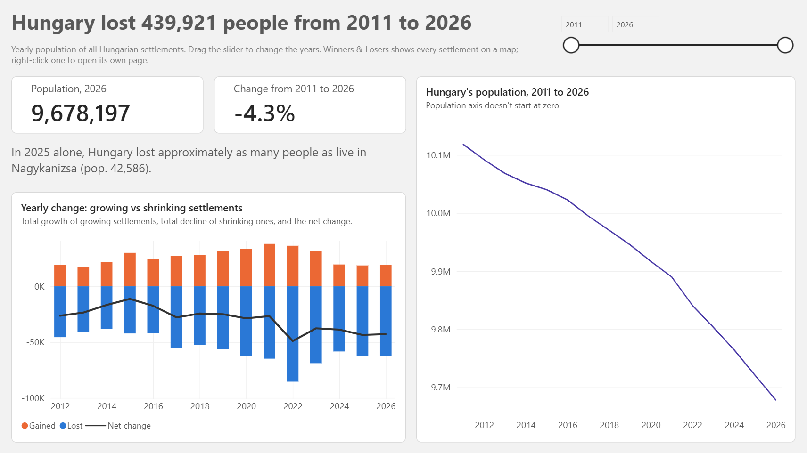
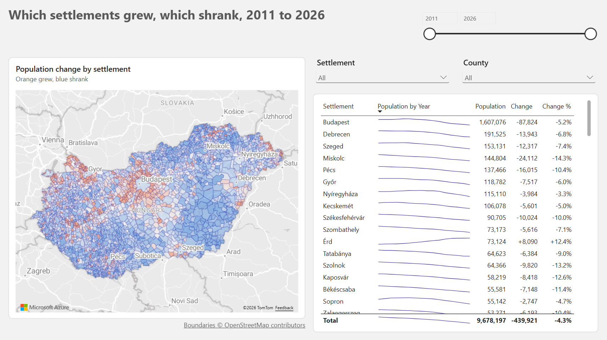
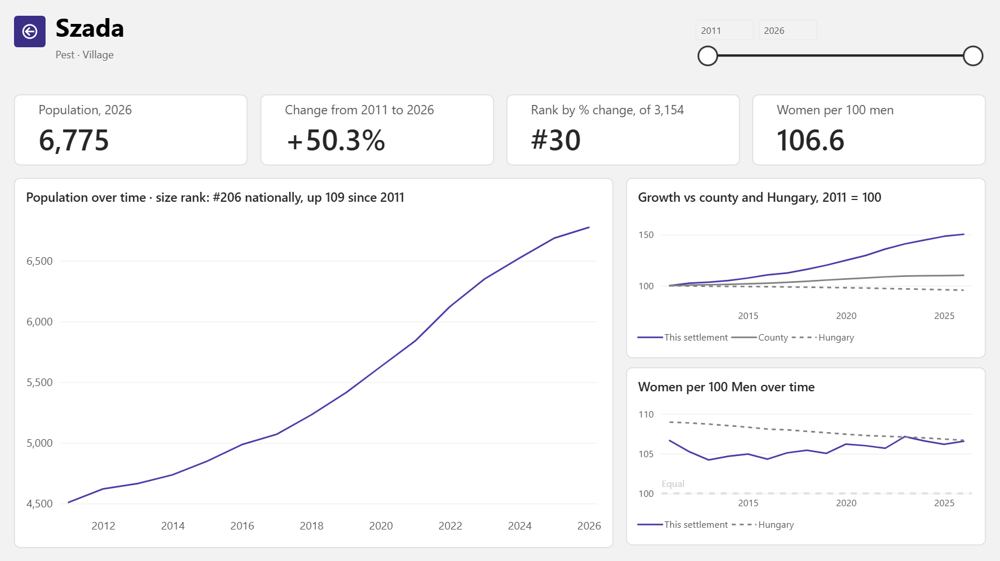

# Hungary Population Monitor (Power BI)

How every Hungarian settlement grew or shrank since 2011, on a map you can click through.

**[Open the live report](https://app.powerbi.com/view?r=eyJrIjoiYmNkMzhkODgtNzQ1Zi00YTgyLWEyZmItNWE2MTQ0NDViMDU3IiwidCI6ImZlMGI5N2NkLTdlZWItNDczMy1iYjEwLTUyMGViN2Q2MDI3MyJ9&language=en-US)** (no sign-in needed, best viewed on desktop)

## What's inside

- **Overview:** national population trend, plus people gained, lost and net change per year.
- **Winners & Losers:** all 3,154 settlements on a map, coloured by % change over the years you pick, with county and settlement filters and a ranked table.
- **Settlement:** right-click any settlement on the map or in the table to open its own page with population, rank, growth against its county and Hungary, and women per 100 men.

## How it's built

- **Star schema:** one population fact table with settlement, county, settlement type and year dimensions, loaded with Power Query from the yearly source files. Budapest's 23 districts are combined into one settlement.
- **Settlement boundaries:** an Azure Maps reference layer with a simplified GeoJSON of every settlement, matched on settlement name. Name lookup alone put some villages in the wrong country.
- **A map scale that adapts:** the colour range is capped at the 80th percentile of absolute % change among the visible settlements, so a few outliers don't wash out the rest, whatever the filters.
- **Honest gaps:** settlements founded after 2011 show "--" and a note instead of a misleading change.
- **DAX highlights:** RANKX over non-blank settlements, an index chart based on the first selected year (ALLSELECTED), comparisons against Hungary with REMOVEFILTERS.
- **Custom theme:** JSON validated against Microsoft's report theme schema. Orange means grew, blue means shrank, violet is the main series.

## Files

- `hpm.pbix`: the report, including its data model. Open it with Power BI Desktop (free).
- `*.xlsx`: the 2011 to 2016 source files. kormany.hu published those years in the old .xls format, which Power BI only reads with an extra Microsoft driver (the Access Database Engine) installed. They won't change, so I converted them to .xlsx once, and the report needs no extra driver.

## Data and credits

- Population: yearly settlement population files published on [kormany.hu](https://kormany.hu), (2011 to 2016 converted from .xls to .xlsx).
- Boundaries © [OpenStreetMap contributors](https://www.openstreetmap.org/copyright), available under the Open Database License (ODbL).
- Base map: Microsoft Azure Maps.

## Related

The same data as a Python and Streamlit app: [hungary-population-monitor](https://github.com/david-danka/hungary-population-monitor)
